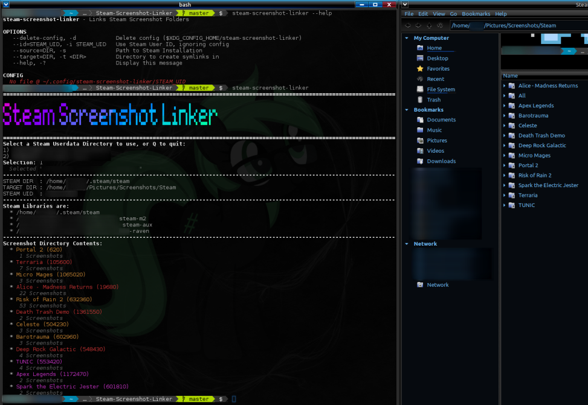

# Steam Screenshot Linker
A shell script to make finding your Steam Screenshots on Linux less difficult.

Credit to [Zee66 on DeviantArt For the pony in the Terminal Background](https://www.deviantart.com/zee66/art/Terminal-Pony-2-384706996). This has nothing  to do with the project, but I felt it was important to credit art in the screencap.

## What Does This Do?
When run, **Steam Screenshot Linker** will create symbolic links for each of your games with screenhots under `~/Pictures/Screenshots/Steam/INSERT_GAME_HERE`

This will make locating your Screenshots taken with the Steam overlay for particular games FAR easier!

On first run, you will be prompted to select a User ID from the ones with data on your system.

## How Best To Use This
Once you've manually run it once to store your Steam User ID in its config, you can set it up as a cronjob to automate updating the folder.

## Where Does This Get Its Data?
All **LOCALLY**

This script works by parsing the following files
* `~/.steam/steam/libraryfolders.vdf` (To Locate all your library folders)
* `~/.steam/steam/userdata/USER_ID` (folder name; To identify valid User IDs)
* `~/.steam/steam/userdata/USER_ID/config/localconfig.vdf` (Gets account Display Name for ID Select Prompt)
* `~/.steam/steam/userdata/USER_ID/760/remote/GAME_ID` (Screenshot Folders; gives Game ID)
* Any relevant `appmanifest_GAME_ID.acf` files (Gets name of Game)

After selecting a User ID, it is stored at
`$XDG_CONFIG_HOME/steam-screenshot-linker/STEAM_UID`
for later refrence
